# IEEE 802.15.4a CSS PHY Transmitter

**MATLAB → RTL → verification → ZedBoard FPGA → 90 nm ASIC, with a Cartesian-to-Polar architecture redesign.**

This repository contains the graduation project developed for the ITI Digital IC Design track. The work starts from the IEEE 802.15.4a chirp-spread-spectrum PHY transmitter, builds a MATLAB golden model, implements the transmitter in Verilog, then compares two hardware architectures:

- **Cartesian:** chirps and DQPSK symbols are handled in real/imaginary form and combined with complex multiplication.
- **Polar:** the same unit-magnitude operations are moved to the phase domain so the expensive complex multiplication becomes phase addition followed by a sine/cosine lookup.

Both versions were verified and implemented independently on a **ZedBoard / XC7Z020** at a **32 MHz core clock**. ASIC synthesis used the **90 nm** standard-cell library at the reported worst operating condition. Both architectures were then carried through post-synthesis equivalence, scan insertion, post-DFT equivalence, floorplanning, power planning, placement, CTS and detailed routing. The public repository now contains readable result artifacts for **both Cartesian and Polar through the final routed stage**.

| Result | Cartesian | Polar | Change with Polar |
|---|---:|---:|---:|
| FPGA LUTs, full ZedBoard top | 538 | 375 | **-30.3%** |
| FPGA modulator LUTs | 350 | 162 | **-53.7%** |
| FPGA total estimated power | 0.230 W | 0.220 W | **-4.35%** |
| FPGA setup WNS | +18.624 ns | +23.634 ns | **+5.010 ns** |
| ASIC synthesis total area | 92,373.49 | 89,141.04 | **-3.50%** |
| ASIC modulator cell area | 17,414.55 | 13,582.54 | **-22.0%** |
| ASIC synthesis total power | 345.477 µW | 338.777 µW | **-1.94%** |
| ASIC DFT stuck-at coverage | 99.95% | 99.95% | same reported coverage |
| ASIC post-route netlist cell area | 86,539.16 | 85,078.43 | **-1.69%** |
| ASIC post-route setup WNS | +13.89 ns | +20.59 ns | **+6.70 ns margin** |
| ASIC routed wire length | 312,109 µm | 281,990 µm | **-9.65%** |
| ASIC route DRCs / opens / shorts | 0 / 0 / 0 | 0 / 0 / 0 | both clean |

> [!NOTE]
> FPGA power values are Vivado estimates with **Medium** confidence. ASIC synthesis power is a low-effort Design Compiler estimate with unannotated activity on some signals. Use the numbers for an implementation comparison, not as bench measurements.

## Navigation

- [Project story](#project-story)
- [System at a glance](#system-at-a-glance)
- [From the ITI reference model to our project golden model](#from-the-iti-reference-model-to-our-project-golden-model)
- [Why we moved from Cartesian to Polar](#why-we-moved-from-cartesian-to-polar)
- [Cartesian and Polar trade-offs](#cartesian-and-polar-trade-offs)
- [RTL architecture](#rtl-architecture)
- [Verification](#verification)
- [FPGA implementation](#fpga-implementation)
- [ASIC implementation](#asic-implementation)
- [Complete Cartesian vs Polar comparison](#complete-cartesian-vs-polar-comparison)
- [Repository structure](#repository-structure)
- [Run it on a ZedBoard](#run-it-on-a-zedboard)
- [MATLAB golden model](#matlab-golden-model)
- [Reports and reproducibility notes](#reports-and-reproducibility-notes)
- [Contributors](#contributors)

## Project story

The first objective was not to optimize hardware. It was to make the complete PHY chain understandable and testable.

The work started from the MATLAB reference model supplied through ITI. We first used it to understand packet generation, Walsh-Hadamard mapping, interleaving, DQPSK and CSS modulation. We then adapted that reference into a project-specific fixed-point golden model with hardware-oriented intermediate vectors and explicit chirp sequencing. That project model became the numerical reference used while building and checking the RTL. The initial RTL followed the straightforward Cartesian representation from the reference design: keep complex signals as real and imaginary components, store chirp samples, and perform complex multiplication.

That implementation worked, but it exposed the hardware cost of doing a multiplication that is mathematically unnecessary for unit-magnitude signals. DQPSK changes phase. The CSS chirp is also naturally described by phase. Once both were written that way, the transmitter could be reorganized around frequency and phase accumulators instead of complex arithmetic.

The project therefore became a controlled architecture experiment: keep the framer, packet format, clock target and external behavior fixed, change the modulation representation, then measure what happened in simulation, FPGA implementation and ASIC implementation.

## System at a glance

The implemented transmitter supports the two project data-rate modes:

| `rate` | Data rate | Mapper behavior |
|---:|---:|---|
| `0` | 1 Mb/s | rate-dependent Walsh-Hadamard path, no 250 kb/s interleaving mode |
| `1` | 250 kb/s | 6-bit symbol mapping to a 32-chip Walsh codeword with the corresponding interleaving behavior |

The main digital path is:

```text
Payload RAM
   ↓
PPDU controller / SHR / PHR / payload mux
   ↓
Bit accumulator
   ↓
Walsh-Hadamard symbol mapping
   ↓
Rate-dependent interleaving
   ↓
I/Q demultiplexing
   ↓
DQPSK + CSS modulator
   ↓
6-bit real and 6-bit imaginary waveform samples
```

The MATLAB work explored fixed-point output quantization and generated the vectors used while developing the RTL. The final FPGA datapaths expose **6-bit I and 6-bit Q digital samples**.

## From the ITI reference model to our project golden model

The MATLAB work did not begin from an empty file. ITI supplied a working CSS transmitter model, and that model was useful because it already represented the standard-level chain. The project version kept the underlying PHY behavior but changed the way the model is driven and observed so that it could act as an RTL golden reference.

The important distinction is therefore **reference model versus hardware-oriented golden model**, not "old code versus new code." The ITI version was mainly an end-to-end communications model. Our version was reshaped around the boundaries we needed to verify in Verilog.

| Point | ITI reference model | Project golden model | Why we changed it |
|---|---|---|---|
| Main use | End-to-end CSS transmitter simulation | Fixed-point RTL reference and vector generation | RTL verification needs deterministic values at internal boundaries, not only a final waveform |
| Chirp selection | A single global `chirpIndex` is selected for a run | All four chirp families are generated and `m_index` rotates **1 -> 2 -> 3 -> 4** | The RTL has to sequence the chirp family during continuous transmission rather than rerun MATLAB for each family |
| DQPSK-to-chirp handoff | `ChirpSpreadSpectrum_Tx` generates DQPSK and immediately modulates it with the selected chirp | DQPSK symbols are exported, then consumed in **8-symbol blocks** by the chirp modulator | This makes the DQPSK stage and the chirp stage independently observable and easier to compare against RTL |
| Chirp timing | `Tgap` and timing state are obtained through the global configuration | `chirpModulation` receives the chirp index and computes the corresponding gap pair locally | Each chirp family can be called explicitly without depending on a previously selected global state |
| Intermediate visibility | Mostly end-to-end output plus the original chirp/codeword files | Adds `iq_bit_streams_before_mapper.txt`, `IQ_paths_output.txt`, `DQPSK_output.txt` and final modulated I/Q export files | These files provide checkpoints for framer, mapper, DQPSK and modulation testbenches |
| Fixed-point export | The supplied configuration uses a 6-bit DAC setting | The final MATLAB package sets the fixed-point export experiment to **5 bits** | The report investigated the minimum practical DAC resolution and selected 5 bits as a quantization/power trade-off for the MATLAB reference experiment |
| Input generation | Generic payload flow from the reference package | Adds `data_input.txt` and a PSDU-generation helper | Repeatable payloads make waveform and RTL comparisons easier to reproduce |

A representative change is the chirp loop. The project model creates the four quantized chirp bases first, then applies them to successive DQPSK chunks. In simplified form:

```text
m = 1
for each 8-symbol DQPSK block:
    select chirp[m]
    modulate the block
    m = (m mod 4) + 1
```

That orchestration matches the hardware problem much better than selecting one chirp family globally and treating the transmitter as one opaque MATLAB function.

> [!NOTE]
> The final MATLAB archive contains a **5-bit fixed-point export path**, while the delivered FPGA RTL exposes **6-bit I and 6-bit Q outputs**. These are two different stages of the project. The 5-bit MATLAB path records the quantization study used while building the golden reference; the final board interface is the 6-bit RTL implementation reported in the FPGA results below.

The public `matlab/` directory contains the team's final adapted model and generated verification files. The original ITI package is not duplicated in the public repository.

## Why we moved from Cartesian to Polar

The key observation came directly from the modulation equations, not from a synthesis trick.

A complex sample in Cartesian form is

$$
x = I + jQ
$$

and multiplying two complex values gives

$$
(I_1+jQ_1)(I_2+jQ_2)
=
(I_1I_2-Q_1Q_2)+j(I_1Q_2+Q_1I_2).
$$

A generic hardware implementation therefore needs four real multiplications plus additions/subtractions.

For a unit-magnitude chirp, however,

$$
s(t)=e^{j\theta(t)}
$$

with

$$
\theta(t)=\omega_c t + \frac{k}{2}t^2+\phi,
$$

so the instantaneous angular frequency is

$$
\omega_i(t)=\frac{d\theta(t)}{dt}=\omega_c+kt.
$$

DQPSK contributes another unit-magnitude phase term. Multiplication becomes

$$
e^{j\theta}e^{j\phi_{DQPSK}}
=
e^{j(\theta+\phi_{DQPSK})}.
$$

That changes the hardware problem. Instead of multiplying two complex numbers, the Polar design updates frequency, integrates frequency into phase, adds the DQPSK phase, then maps the final phase to sine/cosine samples.

A simplified discrete-time view is

$$
\omega[n+1]=\omega[n]+\Delta\omega
$$

$$
\theta[n+1]=\theta[n]+\omega[n]
$$

followed by

$$
I[n]=\cos(\theta[n]),\qquad Q[n]=\sin(\theta[n]).
$$

The actual RTL uses fixed-width accumulators and LUT addressing; the equations above explain the architecture rather than replacing the implementation details in `rtl/polar/`.

### The handwritten derivation

These are the original notes used while moving from the reference architecture to the phase-domain implementation.

| Architecture sketch | Phase derivation | Fixed-point / frequency notes |
|---|---|---|
| 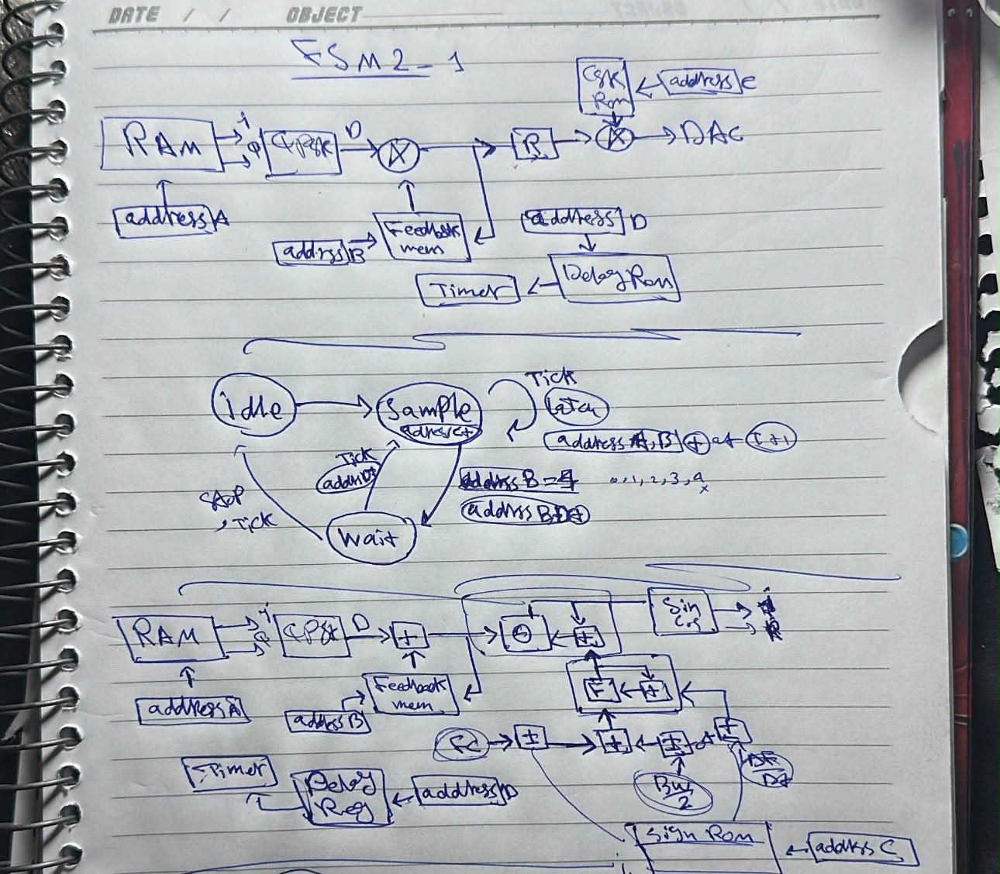 | 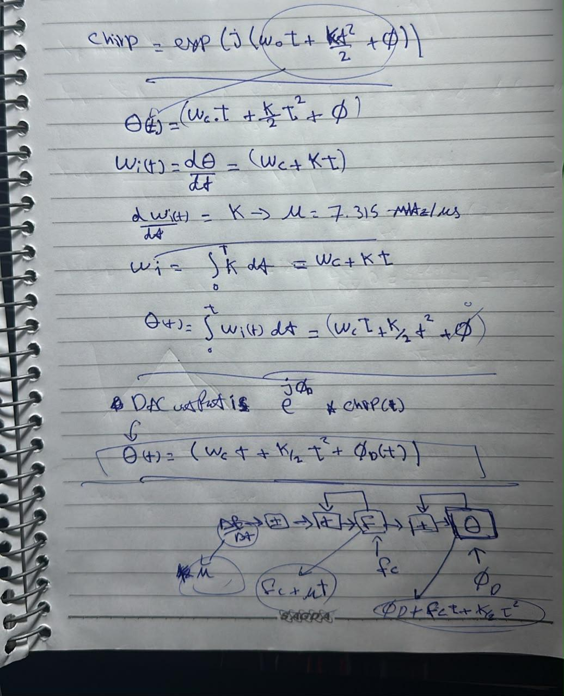 | 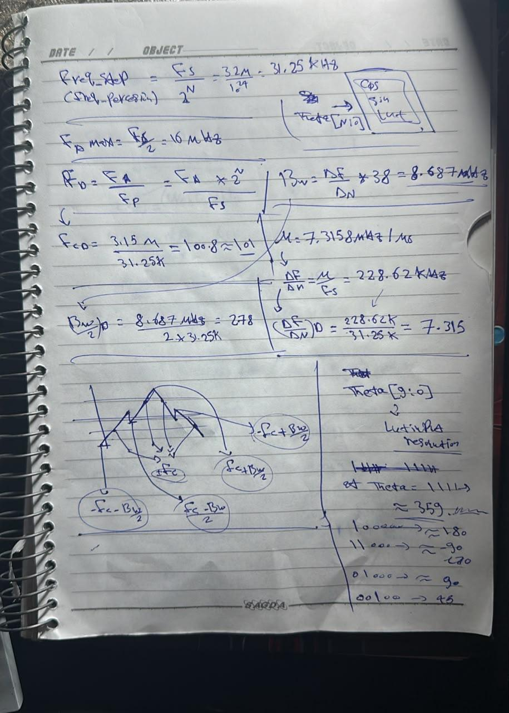 |

The middle sheet is the central idea: write the chirp as a complex exponential, differentiate phase to get frequency, and use phase addition for DQPSK rather than a complex multiply.

## Cartesian and Polar trade-offs

Polar is not automatically better for every complex-valued signal. It is attractive here because the CSS chirp and DQPSK state are dominated by **phase** while their magnitude is fixed or known. That lets the implementation remove arithmetic that a fully general complex signal would still need.

| Engineering point | Cartesian architecture | Polar architecture |
|---|---|---|
| Internal representation | Signed real and imaginary samples, `I + jQ` | Frequency/phase state followed by sine/cosine reconstruction |
| Main operation for DQPSK + chirp | Complex multiplication | Phase addition |
| Main advantage | Direct, intuitive mapping from the ITI reference and easy sample-by-sample I/Q debugging | Exploits the unit-magnitude property and removes most of the complex-product logic |
| Generality | Naturally handles arbitrary complex amplitudes and phases | Best when magnitude is fixed or separately simple; less attractive if amplitude changes are part of the modulation |
| Quantization concern | I/Q sample quantization and coefficient precision | Phase-accumulator width, wraparound, frequency-step precision and sine/cosine LUT resolution |
| Storage/arithmetic tendency | Stores or generates real and imaginary chirp components and combines them in Cartesian arithmetic | Stores compact phase/frequency information, then reconstructs I/Q at the output |
| Sequential state | Lower FF count in the measured FPGA top | Slightly more state because of the accumulator-oriented datapath |
| Verification advantage | Closest to the original MATLAB formulation, so it is the easiest first hardware implementation to validate | Requires an extra derivation step, but can be checked against both Cartesian RTL and MATLAB |

### What the implementation numbers say

The trade-off is visible most clearly inside the modulator rather than at the complete transmitter top:

- FPGA modulator LUTs fall from **350 to 162**, which is **188 LUTs fewer or 53.7%**.
- Full FPGA LUT count falls from **538 to 375**, a **30.3%** reduction after shared framer, clocking and memory are included.
- The Polar FPGA uses **16 more top-level FFs** (`247` versus `231`), consistent with moving work toward accumulators and state rather than pure combinational arithmetic.
- FPGA setup WNS improves from **+18.624 ns to +23.634 ns**, giving **5.010 ns** more margin at the same 31.25 ns clock period.
- ASIC modulator cell area falls from **17,414.55 to 13,582.54**, a **22.0%** reduction.
- The CSS/CSK generator itself falls from **13,324.49 to 8,472.27**, a **36.4%** reduction.
- Whole-ASIC area improves by only **3.50%** because the common standard-cell payload RAM dominates the design and hides part of the datapath saving.
- ASIC non-combinational area rises from **31,879.07 to 33,714.89**, or **5.76%**, so the Polar implementation is not simply "smaller everywhere." It trades some sequential storage for much less combinational modulation logic.
- After detailed routing, Polar still keeps the area advantage: netlist cell area falls from **86,539.16 to 85,078.43** (**-1.69%**) and the area including physical-only cells falls from **119,239.37 to 117,920.56** (**-1.11%**).
- Routed wire length falls from **312,109 µm to 281,990 µm**, a **9.65%** reduction. The physical benefit is therefore larger in wiring than the final cell-area percentage alone suggests.
- Post-route setup WNS improves from **+13.89 ns to +20.59 ns**, while hold WNS changes from **+0.41 ns to +0.18 ns**. Polar has much more setup margin, but Cartesian has the larger hold margin; both remain violation-free.
- DFT coverage is **99.95% for both**. Polar needs **1,321 scan cells** versus **1,264** for Cartesian, which is consistent with the extra sequential state already visible in the architecture.

For this transmitter, that is the reason we kept both implementations. Cartesian was the clean baseline and the easiest architecture to validate against the reference model. Polar was the architecture experiment that tested whether the mathematics of CSS and DQPSK could reduce real hardware cost without changing the transmitted waveform. The final physical results show that the architectural simplification survives implementation: the biggest wins remain inside the modulator and in routing complexity, while the shared standard-cell payload RAM limits the percentage reduction seen at whole-chip level.

## RTL architecture

### Cartesian datapath

The Cartesian modulator stores real/imaginary chirp data and combines the chirp with the DQPSK state in complex arithmetic.

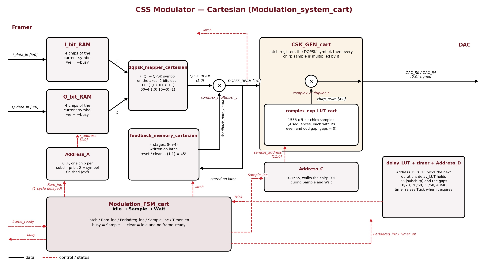

Important blocks are in `rtl/cartesian/`:

- `Moudulation_cart.v`: top modulation datapath.
- `CSK_GEN_cart.v`: chirp-sequence generation.
- `complex_exp_LUT_cart.v`: stored Cartesian chirp samples.
- `complex_multiplier.v`: complex product used in the modulation chain.
- `qpsk_mapper_cart.v` and `feedback_memory_cart.v`: differential phase state in Cartesian form.

### Polar datapath

The Polar design moves the same operation into phase/frequency arithmetic.

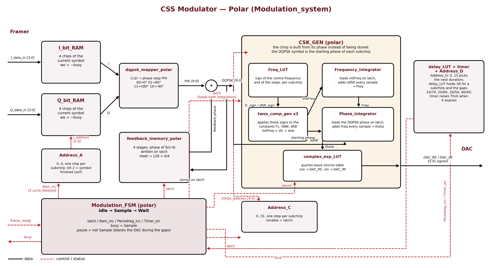

The main blocks are:

- `Moudulation_polar.v`: top modulation datapath.
- `CSK_GEN_polar.v`: frequency and phase generation.
- `integrator.v`: fixed-width accumulator used for frequency and phase.
- `Freq_LUTS.v`: chirp-dependent frequency-direction control.
- `complex_exp_LUT_polar.v`: sine/cosine reconstruction from accumulated phase.
- `qpsk_mapper_polar.v` and `feedback_memory_polar.v`: DQPSK phase state.

The final Polar top instantiates the modulator with a **12-bit phase path**. The Cartesian top uses the original Cartesian parameterization while both produce 6-bit I/Q samples at the external interface.

### Shared controller

The modulation timing is controlled by the same state-machine concept in both architectures.

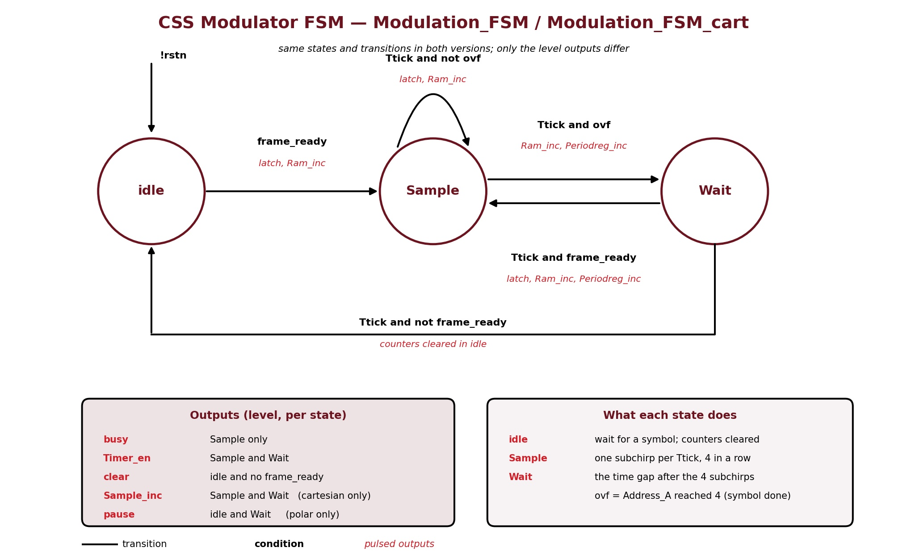

Shared packet/framing and utility logic lives under `rtl/common/`. The cleaned repository uses one canonical copy instead of keeping the same files duplicated under both implementations.

## Verification

Verification was done at more than one boundary:

1. Component tests for SHR and Walsh-Hadamard mapping.
2. Framer tests across both data rates and handshake timing.
3. Modulation-level Cartesian/Polar comparison.
4. Full transmitter tests.
5. RTL waveform comparison against MATLAB-generated behavior.

### Cartesian vs Polar waveform

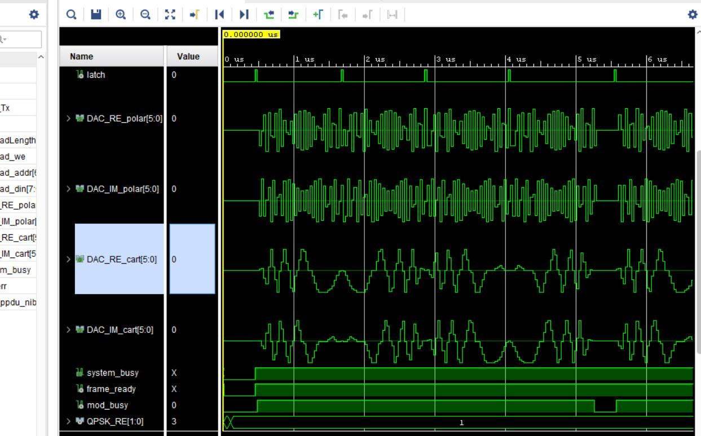

### RTL vs MATLAB reference

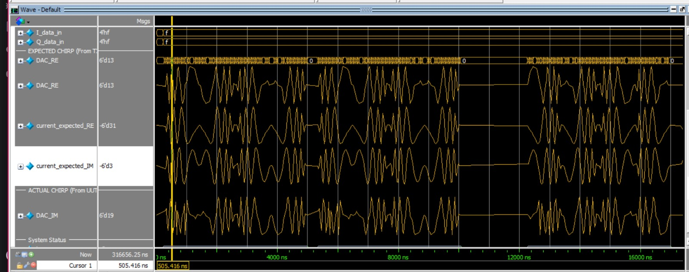

### Framer self-check

The retained transcript image shows the self-checking framer test completing **12 tests across both data rates**.

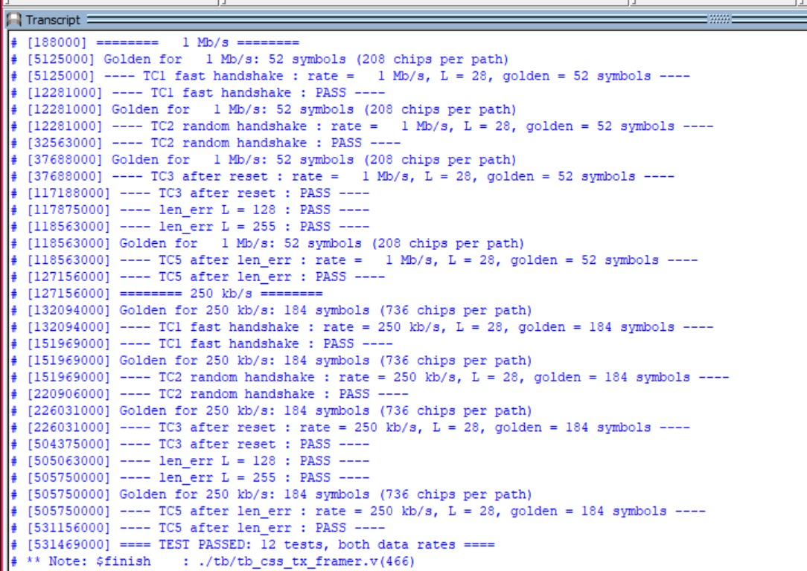

Additional framer/controller waveform captures are in `docs/images/verification/`. The testbenches are under `verification/testbenches/`, and the retained mapper/SHR vectors are under `verification/vectors/`.

> [!IMPORTANT]
> The archived framer testbench refers to two MATLAB I/Q golden files named `IQ_paths_output_1Mbps.txt` and `IQ_paths_output_250kbps.txt`. Those two files were not present anywhere in the supplied final archive, so they are not fabricated in this repository. The testbench itself is retained because it was part of the verified project history.

## FPGA implementation

### Target and clocking

- **Tool used for the retained reports:** Vivado 2020.1.
- **FPGA:** `xc7z020clg484-1` on ZedBoard.
- **Board clock:** 100 MHz.
- **Core clock:** 32 MHz generated by the board wrapper MMCM (`100 × 8 / 25`).
- **Core period:** 31.25 ns.
- **Outputs:** 6-bit real samples and 6-bit imaginary samples on Pmod pins.
- **Implementation comparison:** each architecture was built separately with its own top-level wrapper and the same board/clock target.

### Cartesian FPGA result

| Metric | Result |
|---|---:|
| Top-level LUTs | **538** |
| Top-level FFs | **231** |
| RAMB18 | **1** |
| DSPs | **0** |
| Transmitter core LUTs | **524** |
| Transmitter core FFs | **194** |
| Modulator LUTs | **350** |
| Modulator FFs | **79** |
| Setup WNS | **+18.624 ns** |
| Setup TNS | **0 ns** |
| Hold WNS | **+0.118 ns** |
| Hold TNS | **0 ns** |
| Estimated total on-chip power | **0.230 W** |
| Estimated dynamic power | **0.122 W** |
| Estimated static power | **0.108 W** |
| Estimated junction temperature | **27.6 °C** |

| Utilization | Timing | Power |
|---|---|---|
| 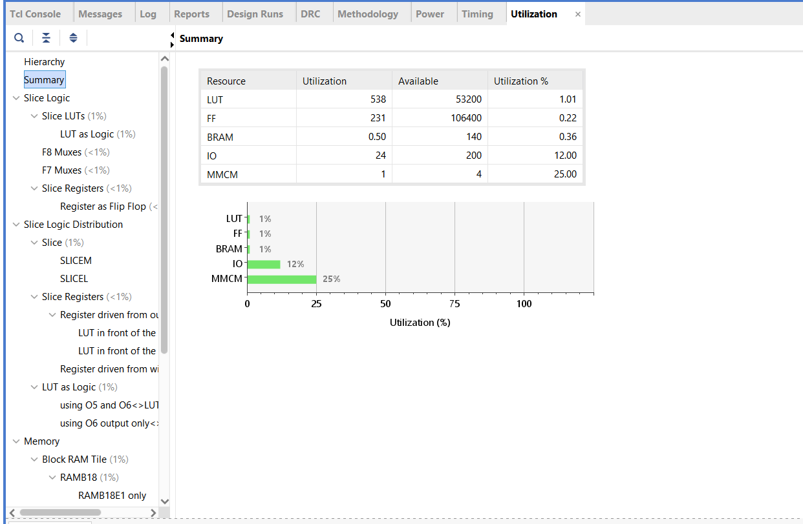 | 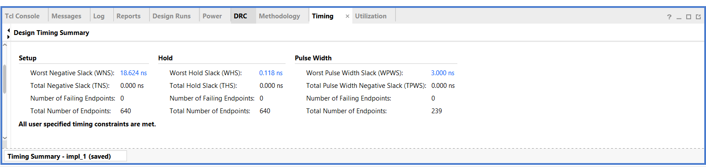 | 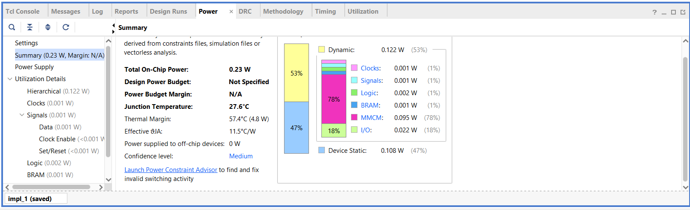 |

### Polar FPGA result

| Metric | Result |
|---|---:|
| Top-level LUTs | **375** |
| Top-level FFs | **247** |
| RAMB18 | **1** |
| DSPs | **0** |
| Transmitter core LUTs | **362** |
| Transmitter core FFs | **210** |
| Modulator LUTs | **162** |
| Modulator FFs | **78** |
| Setup WNS | **+23.634 ns** |
| Setup TNS | **0 ns** |
| Hold WNS | **+0.122 ns** |
| Hold TNS | **0 ns** |
| Estimated total on-chip power | **0.220 W** |
| Estimated dynamic power | **0.112 W** |
| Estimated static power | **0.108 W** |
| Estimated junction temperature | **27.5 °C** |

| Utilization | Timing | Power |
|---|---|---|
| 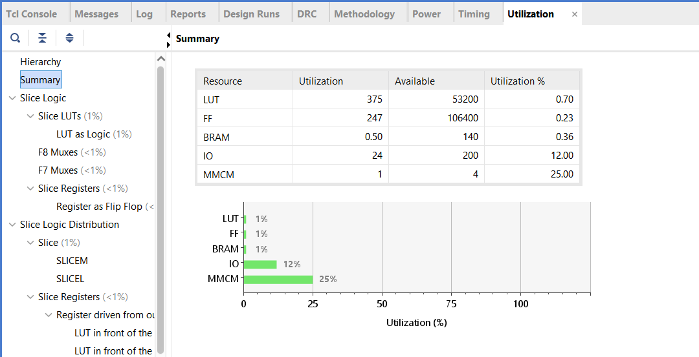 | 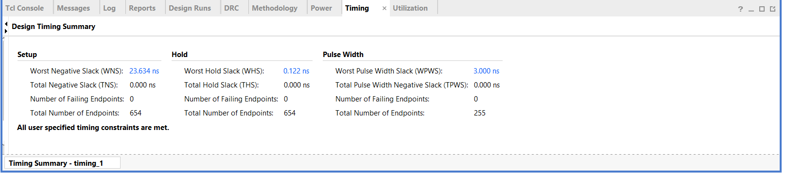 | 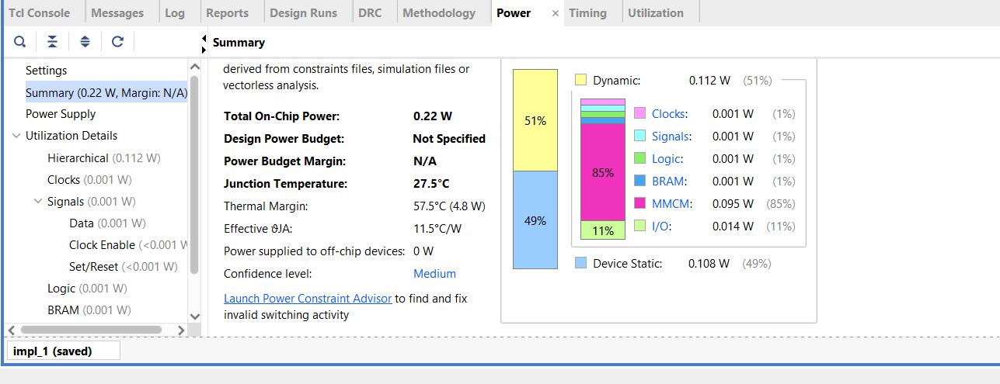 |

Both implementations meet the required 32 MHz timing constraint in the retained Vivado reports.

## ASIC implementation

The implementation sequence was:

```text
ASIC-safe RTL
   ↓
Design Compiler synthesis
   ↓
Formality post-synthesis
   ↓
Scan DFT
   ↓
Formality post-DFT
   ↓
Floorplan → power planning → placement → CTS → routing
```

### ASIC-specific RTL changes

Two changes mattered at architecture level:

- FPGA-style ROM initialization was replaced by synthesizable constant/case logic for the ASIC source set.
- The payload store was reorganized because the educational 90 nm environment did not provide a characterized SRAM macro for this memory.

The ASIC-adapted RTL is kept separately under `asic/cartesian/rtl/` and `asic/polar/rtl/`; it should not be confused with the FPGA-oriented memory initialization in `rtl/`.

### Major problem: the 128 × 8 payload RAM

The payload RAM became the dominant physical problem in synthesis. With no SRAM macro available, the logical 128 × 8 memory was synthesized into standard-cell storage plus address decode logic.

The timing-debug sequence was:

1. The first real synthesis missed setup by about **0.61 ns** on the external payload write path.
2. Registering the write request moved the critical path inside the memory instead of hiding the issue.
3. The remaining path through the flat 128-entry decode was still about **31.14 ns**, identifying decoder/fanout rather than the input interface as the bottleneck.
4. The memory was partitioned into **16 banks × 8 bytes**.
5. Timing then closed at the original **31.25 ns / 32 MHz** constraint. The clock target was not relaxed to make the report green.

The final synthesis power reports also show how dominant the standard-cell RAM is:

| Architecture | Payload RAM estimated power | Share of top synthesis power |
|---|---:|---:|
| Cartesian | 234.482 µW | **67.9%** |
| Polar | 236.601 µW | **69.8%** |

This is why a production version should map the payload store to an appropriate SRAM macro when one is available.

### Major problem: ICC2 export crash after a saved physical checkpoint

The physical-design work also exposed an old ICC2 `O-2018.06-SP1` failure mode in the text/DEF export path. The important detail is that the implementation database had already been saved before the export process failed. The failure was therefore separated from the quality of the placement or routing result itself.

The recovery strategy was to treat the saved design database as the authoritative checkpoint, reopen and validate it in a fresh ICC2 session, then run fragile ASCII exports separately. That prevents a valid physical checkpoint from being discarded because an optional text writer crashes. The same policy was used for later physical stages. The public repository does **not** include the recovery scripts, logs or private design databases.

### ASIC synthesis results

The two synthesis reports use the same 31.25 ns target and the same 90 nm worst library condition.

| Metric | Cartesian | Polar | Polar change |
|---|---:|---:|---:|
| Critical path | 30.62 ns | 30.62 ns | same reported length |
| Setup slack | +0.01 ns | +0.00 ns | both closed |
| Violating paths | 0 | 0 | same |
| Leaf cells | 7,362 | 6,684 | **-9.21%** |
| Buffer/inverter cells | 1,990 | 1,783 | **-10.4%** |
| Combinational area | 54,424.17 | 49,481.63 | **-9.08%** |
| Non-combinational area | 31,879.07 | 33,714.89 | **+5.76%** |
| Total cell area | 86,303.23 | 83,196.52 | **-3.60%** |
| Net interconnect area | 6,070.26 | 5,944.52 | **-2.07%** |
| Total design area | 92,373.49 | 89,141.04 | **-3.50%** |
| Modulator cell area | 17,414.55 | 13,582.54 | **-22.0%** |
| CSS/CSK generator cell area | 13,324.49 | 8,472.27 | **-36.4%** |
| Estimated total power | 345.477 µW | 338.777 µW | **-1.94%** |

The smaller Polar modulator is partly masked at whole-chip level by the shared framer and, especially, the standard-cell payload RAM. In the Polar synthesis area report the payload RAM alone occupies about **57,401.86** units of cell area, or roughly **69% of total cell area**.

### Cartesian ASIC flow: complete result set

The new Cartesian ASIC package closes the archival gap from the earlier public version. It contains generated results for every major stage, so the Cartesian implementation can now be documented from actual reports instead of status notes.

| Cartesian stage | Retained result | Key measured result |
|---|---|---|
| Synthesis | `asic/cartesian/synthesis/` | 92,373.49 total design area, +0.01 ns setup slack, 0 violating paths |
| Formality, post-synthesis | `asic/cartesian/formality/post_syn/` | **1,287 passing compare points**, 0 failing, 0 aborted, 0 unverified |
| Scan DFT | `asic/cartesian/dft/` | 1 scan chain, **1,264 scan cells**, **99.95%** stuck-at coverage |
| Formality, post-DFT | `asic/cartesian/formality/post_dft/` | **1,287 passing compare points**, 0 failing, 0 aborted, 0 unverified |
| Floorplan | `asic/cartesian/pnr/floorplan/` | 60.32% site-row utilization, +15.72 ns critical-path slack |
| Power plan | `asic/cartesian/pnr/powerplan/` | retained PG connectivity, via and DRC reports |
| Placement | `asic/cartesian/pnr/placement/` | 56.36% utilization, +14.99 ns setup slack, 0 setup/hold violations |
| CTS | `asic/cartesian/pnr/cts/` | **+14.53 ns setup WNS / +0.42 ns hold WNS**, TNS 0 |
| Detailed routing | `asic/cartesian/pnr/routing/` | **+13.89 ns setup WNS / +0.41 ns hold WNS**, 0 timing violations |
| Route verification | routing checks | **0 DRCs, 0 open nets, 0 shorts** |

#### Cartesian PnR issue: placement was good, the wrapper called it bad

One of the larger flow problems was not a timing failure. During Cartesian placement, ICC2 `O-2018.06-SP1` printed transient `ZRT-064` messages while `create_placement` was performing its internal trial global route. The old generic wrapper interpreted the text as a failed stage even though placement completed, the checkpoint was written and the final placement reports showed **0 timing violations**.

The fix was to validate the stage using the expected saved checkpoint and stage-specific reports, while ignoring only that known transient placement message. The valid placement database was reused and the flow resumed from CTS instead of rerunning a successful stage. The new Cartesian archive proves that this recovery completed correctly: CTS and detailed routing both finish with positive setup/hold slack and the final route checks report zero DRCs, opens and shorts.

### Physical-design milestones

With complete reports for both implementations, the physical stages can now be compared directly rather than mixing Cartesian synthesis with Polar routing.

| Stage | Cartesian | Polar | Observation |
|---|---:|---:|---|
| Floorplan utilization | 60.32% | 60.30% | nearly identical target density |
| Floorplan cell area | 91,636.53 | 90,173.03 | Polar **-1.60%** |
| Placement utilization | 56.36% | 56.25% | nearly identical |
| Placement netlist cell area | 85,621.25 | 84,119.04 | Polar **-1.75%** |
| Placement setup slack | +14.99 ns | +20.78 ns | Polar +5.79 ns margin |
| CTS setup WNS | +14.53 ns | +20.71 ns | Polar +6.18 ns margin |
| CTS hold WNS | +0.42 ns | +0.19 ns | Cartesian +0.23 ns hold margin |
| Post-route setup WNS | **+13.89 ns** | **+20.59 ns** | Polar +6.70 ns margin |
| Post-route hold WNS | **+0.41 ns** | **+0.18 ns** | Cartesian +0.23 ns hold margin |
| Post-route netlist cell area | 86,539.16 | 85,078.43 | Polar **-1.69%** |
| Area incl. physical-only cells | 119,239.37 | 117,920.56 | Polar **-1.11%** |
| Routed nets | 7,775 | 7,364 | Polar **411 fewer, -5.29%** |
| Routed wire length | 312,109 µm | 281,990 µm | Polar **30,119 µm less, -9.65%** |
| Routed contacts | 70,508 | 64,999 | Polar **5,509 fewer, -7.81%** |
| Route DRCs | 0 | 0 | both clean |
| Open nets / shorts | 0 / 0 | 0 / 0 | both clean |

The floorplans were intentionally kept at almost the same utilization, so the comparison is not the result of giving Polar a looser placement target. The final routed data shows three separate effects: slightly lower cell area, substantially shorter wiring, and much larger setup margin. At the same time, Cartesian keeps more hold margin. Both designs close timing at the same **31.25 ns** clock period.

| Cartesian physical view | Polar physical view |
|---|---|
| 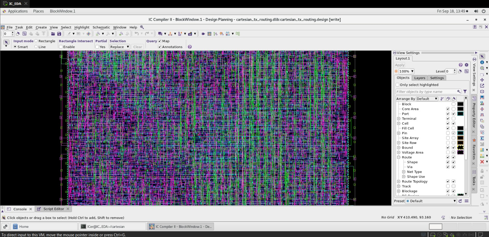 | 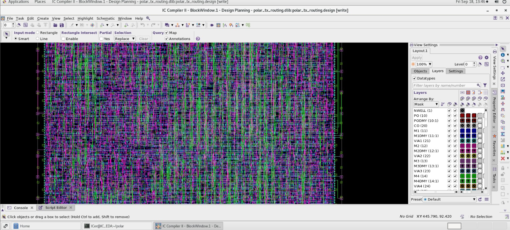 |

> [!NOTE]
> The routed QoR files report cell area and timing, but the retained PnR result sets do not provide a comparable final post-route power report for both architectures. Power is therefore compared at the common Design Compiler synthesis stage instead of mixing power numbers from different analysis points.

### DFT and formal equivalence

Both architectures have complete retained scan and equivalence summaries.

| DFT metric | Cartesian | Polar |
|---|---:|---:|
| Scan chains | 1 | 1 |
| Scan cells / chain length | **1,264** | **1,321** |
| Uncollapsed stuck-at faults | 58,256 | 54,842 |
| Detected faults | 58,104 | 54,430 |
| Undetectable faults | 121 | 386 |
| ATPG-untestable faults | 31 | 26 |
| Reported test coverage | **99.95%** | **99.95%** |
| DFT total cell area | 91,636.53 | 90,173.03 |
| DFT total design area | 98,310.90 | 96,794.75 |
| DFT setup slack | +0.03 ns | +0.01 ns |
| DFT setup/hold violating paths | 0 / 0 | 0 / 0 |

Both DFT coverage reports also record **182 C26 clock-as-data warnings** while stating that 0 sequential cells have sequential-cell violations. Those warnings are preserved in the repository rather than being hidden behind the headline coverage number.

Formality closes cleanly for both architectures before and after scan insertion:

| Formality stage | Cartesian | Polar |
|---|---|---|
| Post-synthesis | 1,287 passing; **0 failing / 0 aborted / 0 unverified** | 1,304 passing; **0 failing / 0 aborted / 0 unverified** |
| Post-DFT | 1,287 passing; **0 failing / 0 aborted / 0 unverified** | 1,304 passing; **0 failing / 0 aborted / 0 unverified** |

The different number of compare points reflects the different implementation structures; equivalence is judged by the absence of failing, aborted or unverified points within each architecture's own reference/implementation pair.

## Complete Cartesian vs Polar comparison

This section compares like-for-like implementation stages. FPGA numbers come from the two routed Vivado designs. ASIC synthesis and DFT numbers come from the corresponding reports under the same 31.25 ns target, and the physical comparison uses the final detailed-routing reports for both architectures.

### FPGA comparison

| Metric | Cartesian | Polar | Difference |
|---|---:|---:|---:|
| Full-top LUTs | 538 | 375 | **163 fewer, -30.3%** |
| Transmitter-core LUTs | 524 | 362 | **162 fewer, -30.9%** |
| Modulator LUTs | 350 | 162 | **188 fewer, -53.7%** |
| Full-top FFs | 231 | 247 | **16 more, +6.93%** |
| Transmitter-core FFs | 194 | 210 | **16 more, +8.25%** |
| BRAM18 | 1 | 1 | no change |
| DSP | 0 | 0 | no change |
| Setup WNS | +18.624 ns | +23.634 ns | **+5.010 ns margin** |
| Hold WNS | +0.118 ns | +0.122 ns | +0.004 ns |
| Total estimated power | 0.230 W | 0.220 W | **-4.35%** |
| Dynamic estimated power | 0.122 W | 0.112 W | **-8.20%** |
| Static estimated power | 0.108 W | 0.108 W | no change |

The main FPGA effect is visible in the modulator itself: moving to phase arithmetic cuts the modulator LUT count by **53.7%**. At full-top level the reduction is **30.3%** because the framer, board wrapper, clocking and memory are common to both implementations.

### ASIC comparison

The ASIC result is easiest to read at three levels: synthesis shows the architecture cost before scan/physical optimization, DFT shows the testability overhead, and detailed routing shows what remains after physical implementation.

#### Synthesis

| Metric | Cartesian | Polar | Difference |
|---|---:|---:|---:|
| Leaf cells | 7,362 | 6,684 | **678 fewer, -9.21%** |
| Combinational area | 54,424.17 | 49,481.63 | **-9.08%** |
| Non-combinational area | 31,879.07 | 33,714.89 | **+5.76%** |
| Total cell area | 86,303.23 | 83,196.52 | **-3.60%** |
| Total design area | 92,373.49 | 89,141.04 | **3,232.45 less, -3.50%** |
| Modulator cell area | 17,414.55 | 13,582.54 | **3,832.01 less, -22.0%** |
| CSS/CSK generator area | 13,324.49 | 8,472.27 | **4,852.22 less, -36.4%** |
| Synthesis total power | 345.477 µW | 338.777 µW | **6.700 µW less, -1.94%** |
| Setup violations | 0 | 0 | both closed at 31.25 ns |

#### After scan insertion

| Metric | Cartesian | Polar | Difference |
|---|---:|---:|---:|
| Scan cells | 1,264 | 1,321 | Polar **+57, +4.51%** |
| DFT total cell area | 91,636.53 | 90,173.03 | Polar **-1.60%** |
| DFT total design area | 98,310.90 | 96,794.75 | Polar **-1.54%** |
| Reported stuck-at coverage | 99.95% | 99.95% | same |
| Setup violations | 0 | 0 | both closed |
| Hold violations | 0 | 0 | both closed |

Polar carries more scan state, but its lower combinational cost still leaves the DFT-inserted design smaller overall.

#### After detailed routing

| Metric | Cartesian | Polar | Difference |
|---|---:|---:|---:|
| Setup WNS | +13.89 ns | +20.59 ns | Polar **+6.70 ns margin** |
| Hold WNS | +0.41 ns | +0.18 ns | Cartesian **+0.23 ns margin** |
| Setup / hold TNS | 0 / 0 | 0 / 0 | both clean |
| Netlist cell area | 86,539.16 | 85,078.43 | Polar **-1,460.73, -1.69%** |
| Area incl. physical-only cells | 119,239.37 | 117,920.56 | Polar **-1,318.81, -1.11%** |
| Routed nets | 7,775 | 7,364 | Polar **-411, -5.29%** |
| Routed wire length | 312,109 µm | 281,990 µm | Polar **-30,119 µm, -9.65%** |
| Routed contacts | 70,508 | 64,999 | Polar **-5,509, -7.81%** |
| Route DRCs | 0 | 0 | both clean |
| Open nets | 0 | 0 | both clean |
| Shorts | 0 | 0 | both clean |

The whole-chip area reduction is smaller than the **22% modulator-area** reduction because the two implementations share a very large standard-cell payload RAM and most of the framer. The physical results still show that the phase-domain architecture reduces not only logic but also routing burden: the routed wire length falls by almost **10%**. The timing trade-off is also visible: Polar has substantially more setup margin, while Cartesian retains more hold margin. Neither requires relaxing the original 32 MHz target.

## Repository structure

```text
.
├── README.md
├── rtl/
│   ├── common/
│   │   ├── framer/
│   │   └── general/
│   ├── cartesian/
│   ├── polar/
│   └── memory/
├── verification/
│   ├── testbenches/
│   │   ├── cartesian/
│   │   ├── polar/
│   │   ├── comparison/
│   │   └── framer/
│   └── vectors/
├── matlab/
├── fpga/
│   ├── cartesian/
│   │   ├── reports/
│   │   ├── zedboard_cartesian_final_hw_top.v
│   │   ├── zedboard_cartesian_final.xdc
│   │   └── zedboard_cartesian_final_hw_top.bit
│   └── polar/
│       ├── reports/
│       ├── zedboard_polar_final_hw_top.v
│       ├── zedboard_polar_final.xdc
│       └── zedboard_polar_final_hw_top.bit
├── asic/
│   ├── cartesian/
│   │   ├── rtl/
│   │   ├── synthesis/
│   │   ├── dft/
│   │   ├── formality/
│   │   └── pnr/
│   └── polar/
│       ├── rtl/
│       ├── synthesis/
│       ├── dft/
│       ├── formality/
│       └── pnr/
└── docs/
    ├── project_report.pdf
    └── images/
```

The public tree deliberately does not contain tool run directories, shell/Tcl automation, logs, old checkpoints, chat history, copied PDK/NDM data, duplicate archives or Vivado cache directories.

## Run it on a ZedBoard

The repository contains both the final bitstreams and the RTL needed to rebuild them.

### Fastest path: program the supplied bitstream

For Cartesian, use:

```text
fpga/cartesian/zedboard_cartesian_final_hw_top.bit
```

For Polar, use:

```text
fpga/polar/zedboard_polar_final_hw_top.bit
```

Program the ZedBoard with Vivado Hardware Manager.

Board behavior in both wrappers:

| Board control | Function |
|---|---|
| BTNC | reset |
| BTNR | start one packet |
| SW0 | rate select: `0` = 1 Mb/s, `1` = 250 kb/s |
| LD0 | MMCM locked |
| LD1 | built-in payload loaded |
| LD2 | transmitter busy |
| LD3 | payload-length error |
| LD4 | synchronized rate |
| LD5 | waveform activity detected |
| LD6 | toggles after packet completion |
| LD7 | heartbeat |

The board wrapper automatically writes the four-byte payload `DE AD BE EF` before allowing a packet start.

`tx_real_o[5:0]` is placed on six JA Pmod data pins and `tx_imag_o[5:0]` on six JB Pmod data pins. These are signed digital sample buses, not analog outputs. A real external DAC would need its own interface timing and output-delay constraints.

### Rebuild in Vivado 2020.1

1. Create an RTL project for part **`xc7z020clg484-1`**.
2. Add all shared RTL from `rtl/common/general/` and `rtl/common/framer/`.
3. Add **one** architecture only:
   - Cartesian: `rtl/cartesian/*.v`
   - Polar: `rtl/polar/*.v`
4. Add the required memory initialization files:
   - shared: `rtl/memory/common/dalay_LUT.mem`
   - Cartesian: `rtl/memory/cartesian/chirpSequence_re.mem` and `chirpSequence_im.mem`
   - Polar: `rtl/memory/polar/Freq_LUT.mem` and `sincosLUT.mem`
5. Add the matching board wrapper:
   - `fpga/cartesian/zedboard_cartesian_final_hw_top.v`, or
   - `fpga/polar/zedboard_polar_final_hw_top.v`.
6. Add the matching XDC from the same FPGA directory.
7. Set the board wrapper, **not** `CSS_Transmitter_Top`, as the synthesis top.
8. Run synthesis, implementation and bitstream generation.
9. Compare your reports with the retained files in `fpga/<architecture>/reports/`.

> [!WARNING]
> Do not add Cartesian and Polar `CSS_Transmitter_Top.v` files to the same Vivado source set. They intentionally define alternate implementations of the same top-level role.

## MATLAB golden model

The MATLAB source under `matlab/` is the **final project-adapted model**, not a blind copy of the ITI starting package. MATLAB comments are intentionally preserved because the repository cleanup rule exempts MATLAB source.

Start with:

- `matlab/runMe.m` for the main project flow.
- `matlab/simulationParameters.m` and `matlab/common/globalSettings.m` for configuration and fixed-point settings.
- `matlab/transmitter/ChirpSpreadSpectrum_Tx.m` for packet coding, I/Q path construction, QPSK and DQPSK.
- `matlab/transmitter/chirpModulation.m` for chirp timing and complex modulation.
- `matlab/script_PSDUgen.m` for repeatable payload generation.

The final package also keeps the intermediate files that made the model useful as a golden reference, including `IQ_paths_output.txt`, `iq_bit_streams_before_mapper.txt`, `DQPSK_output.txt`, and the exported real/imaginary modulated sequences. These are more useful for hardware debug than a single final plot because each file corresponds to a boundary that can be checked in a Verilog testbench.

The detailed differences from the ITI starting model, and the reason for each change, are documented in [From the ITI reference model to our project golden model](#from-the-iti-reference-model-to-our-project-golden-model).

## Reports and reproducibility notes

- `docs/project_report.pdf` is the final written report.
- `fpga/*/reports/` contains the final Vivado utilization, timing, power, DRC and clock reports used for the numbers above.
- `asic/*/synthesis/reports/` contains the Design Compiler reports used for the common ASIC comparison.
- `asic/cartesian/pnr/` contains readable setup, floorplan, power-plan, placement, CTS and detailed-routing reports plus the final routed DEF/netlist.
- `asic/cartesian/dft/` and `asic/cartesian/formality/` contain the generated scan/coverage outputs and post-synthesis/post-DFT equivalence reports from the corrected Cartesian archive.
- `asic/polar/pnr/` contains the retained floorplan, placement, CTS and detailed-routing reports.
- `asic/polar/dft/` and `asic/polar/formality/` contain the corresponding quantitative DFT and equivalence evidence.

## Contributors

- **Abdelrahman Ellaban**
- **Mohammed Salah**
- **Abdallah Mahmoud**
- **Alaa Khaled**
- **Yasmin Samir**
